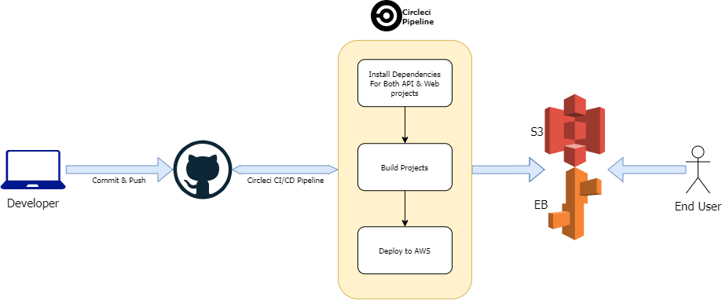

# Pipeline

<!-- TOC -->

- [Pipeline](#pipeline)
    - [Continuous Integration](#continuous-integration)
        - [CircleCI](#circleci)
        - [GitHub](#github)
    - [Scripts](#scripts)

<!-- /TOC -->

## Continuous Integration

To use CircleCI with GitHub you need to connect your GitHub account

### CircleCI

CircleCI builds push hooks by default. So, builds are triggered for all push hooks for the repository and PUSH is the most common case of triggering a build.

When we add a new project to CircleCI, CircleCI creates a deployment key on GitHub for our project for security

CircleCI reads the [config.yml](../.circleci/config.yml) file which tells the service what has to be done. In our projects there are two jobs runs after each push `build` then `deploy`

### GitHub

We must setup our project from CircleCI first, then will trigger a new build after each push the developers made to the GitHub repository.

## Scripts

We add all needed scripts for [config.yml](../.circleci/config.yml) in the root of the project:

- `npm run web:install` - To install frontend dependencies.
- `npm run web:build` - To build the Angular/Frontend.
- `npm run web:deploy` - To deploy the project to S3 using.
- `npm run web:lint` - To check and analyse the code.
- `npm run api:install` - To install backend API dependencies.
- `npm run api:build` - To build & transpile the Typescript/Backend.
- `npm run api:deploy` - To deploy the project to EB.
- `npm run api:format` - To check code.
- `npm run deploy` - To deploy both API & Web.
