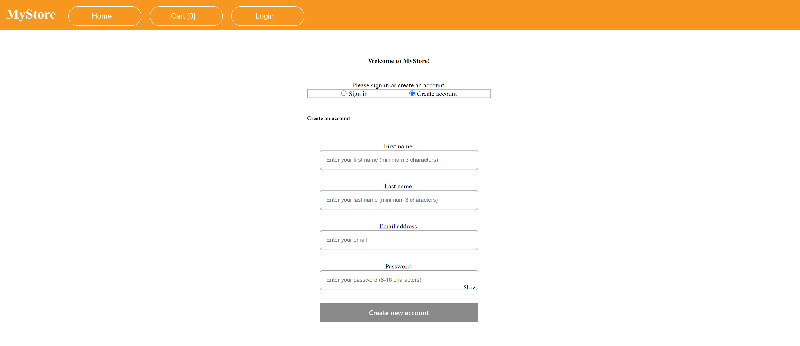
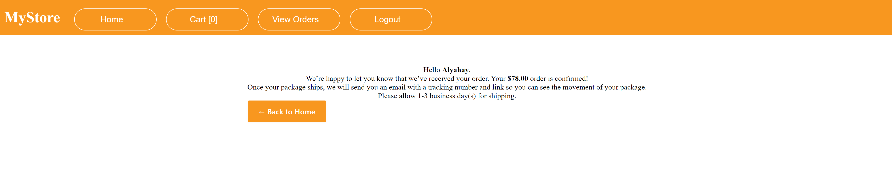
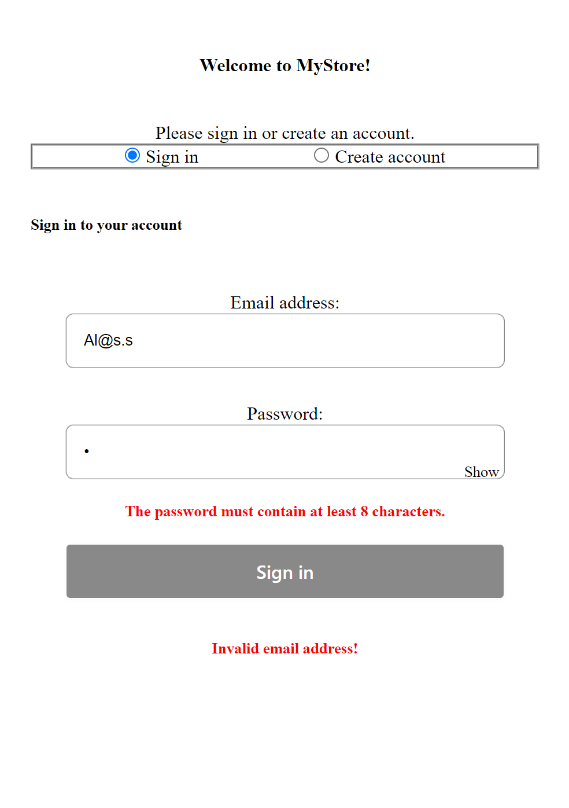

# MyStore Project - Frontend

A shopping site project built with Angular. It's an e-commerce software built based on [Storefront-API](../api/).

## Overview

### Fetures

- View list of products.
- View product details.
- Add/remove products to/from cart.
- View cart including products & total amount.
- Update quantity of product from cart.
- Remove product from cart.
- Place order & Checkout products in cart.
- Confirmation page after order is placed
- Create new user
- Login to the site

## Let's start

Clone this repo then `cd` to the project directory.
Now we must install all packages and dependencies run the following command `npm install`

## Development server

Run `ng serve` for a dev server. Navigate to `http://localhost:4200/`. The application will automatically reload if you change any of the source files.

## Build

Run `ng build` to build the project. The build artifacts will be stored in the `dist/` directory.

## Preview

Homepage

Create a new account

Login to account

Cart page

Order Confirmation

Form Validations:

- Form 1
  

- Form 2
  
  Validation in `Api` level & frontend `web` level

## Running unit tests

Run `ng test` to execute the unit tests via [Karma](https://karma-runner.github.io).
